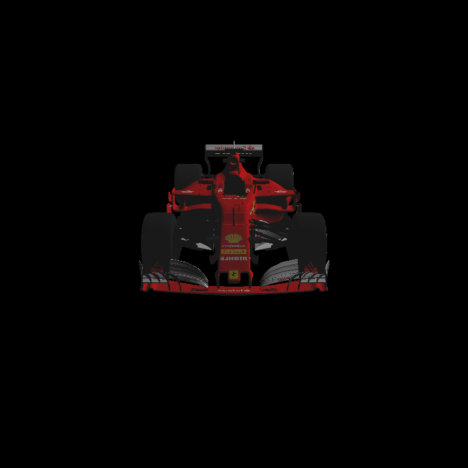

# xxxRasterization
A software renderer written in C++
## Introduction
This is a software rasterizer I developed from scratch, which implements core rendering functionalities such as vertex shading, fragment shading,texture mapping, the Blinn-Phong lighting model, and depth buffering (Z-buffering).

The pipeline starts with vertex processing, where vertex positions are transformed from 3D world space to 2D screen space through projection matrices. This is followed by rasterization, which converts geometric primitives (such as triangles) into fragments—potential pixels on the screen.

Each fragment is then processed in the fragment shading stage, where color values are computed based on material properties, lighting, and surface normals. The Blinn-Phong lighting model is used to simulate diffuse and specular reflections, providing realistic surface shading under dynamic lighting conditions.

To handle visibility and ensure correct object occlusion, the rasterizer also includes a depth buffer, which tracks the depth of each pixel and prevents distant objects from overwriting closer ones.

Overall, this software rasterizer provides a fundamental understanding of the graphics pipeline and serves as a solid base for further enhancements such as texture mapping.

## Display
And the corresponding effects are as follows

  

